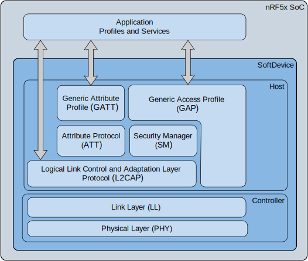

# Description
Battery powered mobile bluetooth pen-tester. Designed to conveniently hangout, say in your pocket, and autonomously pen-test bluetooth 4 & 5 devices in your vicinity. With the rise of IoT in common households, it will be interesting to see which products are doing their due diligence in protecting their consumers from security issues. This will strictly be "white-hat" i.e. any discovered security flaws will be temporarily giggled at, then promptly reported to its distributor. 

Very open to collaboration. Get a message to me via git and lets talk!

# Configuration
* nrf52850 w/ pca10056 processor
    * Note: Should port easily with other boards. See Zephyr supported boards.
* Zephyr RTOS
* Linux system
* Arm Embedded Toolchain
* Nordic JLink for flashing and cpu interface

# Building
* Assuming build on Linux type system. Can probably use cygwin on Windows, but not verified.
1. Setup Zephyr RTOS build environment. [See their documentation](https://docs.zephyrproject.org/latest/getting_started/getting_started.html)

2. Git clone blue-bandit and setup with modifed zephyr
```
git clone https://github.com/DC11011100/blue-bandit.git
cd blue-bandit
git clone https://github.com/DC11011100/zephyr.git
cd ..
west init -l zephyr
west update
```

3. Setup Zephyr with blue-bandit config:
```
cd blue-bandit
source scripts/zenv.sh
```
4. Create cmake generators. In this case: Makefiles:
  
 ```
 mkdir build && cd build
 cmake ..
 ```
 
 5. Build the hex then flash controller
 ```
 make && make flash 
 ```
 
# Modules
#### USB UART Terminal (User)
###### Entering shell
'-con' turns on terminal coloring. Note you may need to point to a different /dev/tty device
```
minicom -D /dev/ttyACM0 -b 115200 -con
```

#### BLE UART Terminal (User)
Secure connection enforced via predetermined key. You will need some special software for this...which I may end up
creating if necessary. TBD
 
###### TODO
   - [ ] Enable secure connection peripheral ble service
   - [ ] Reuse shell from USB UART Shell
        - [ ] Intercept trasport layer and replace USB UART --> BLE UART
   - [ ] Nice 2 Have: Setup Object Transfer Service for gatt. Meant to offload big data that may otherwise inhibit the
         bluetooth shell
        - [ ] Setup parallel bluetooth service thread with object pointer

#### Bluetooth Sniffer (Kernel)
Daemon initiated via system call from user space terminal command.
###### TODO
   - [X] Terminal command --> bb_scan
   - [X] Passive scan for discovering devices --> bb_scan list <scan duration(s)>
   - [ ] Active scan for querying more details from detected devices
   - [ ] Bluetooth packet sniffing capability
   - [ ] Bluetooth profile imposter
   - [ ] Logging
      - [ ] Add flash mem write capability
      - [ ] Link flash mem write with low power events
   - [ ] Man in the middle ?
        - [ ] See Damien Cauquil presentation in Defcon 2018
   
#### Battery (Kernel)
Kernel daemon which broadcasts low-battery/shutoff events and performs preemptive safety functions upon these events.


###### TODO
   - [ ] Add kernel thread to monitor battery level
   - [ ] Add low power broadcasted events
   - [ ] Ability to signal other threads with lower events 
 
#### Hardware
###### TODO
   - [ ] Measure power usage for typical operations
      - [ ] nrf52840 
      - [ ] esp32 (x12 arriving in May >:D )
 
# Misc 
##### Discovered Bluetooth Errata
 * BLE: CVE-2018-7252
   * Demonstrated by Damien Cauquil during Defcon 2018
   
##### Development Tips
 * [Zephyr + Bluez Configuration](https://docs.zephyrproject.org/1.13.0/subsystems/bluetooth/devel.html#bluetooth-bluez)
      * How configure laptop with BlueZ interface to Zephyr BLE
      * Enabling experimental functionality on bluez
      * Using btattach, btmon, etc, with Zephyr config
      
 * Bluetooth Stack Graphic
 
<p align="center">
  
</p>

 
 * [Bluetooth Gatt Services](https://www.bluetooth.com/specifications/gatt/services)
 
 * Setting up 'bluetooth' python module
 Most of this should be relatively obvious system lib and python module dependency issues EXCEPT when trying to install gattlib python module, you may need to follow the following steps. In this case, I was using python 3.7:
 ```
pip3 download gattlib
tar xvzf ./gattlib-0.20150805.tar.gz
cd gattlib-0.20150805/
sed -ie 's/boost_python-py34/boost_python3/' setup.py
pip3 install .
 ```

This can highly vary based on your build system. What I did was search for 'libboost_python*' in my standard lib location.
